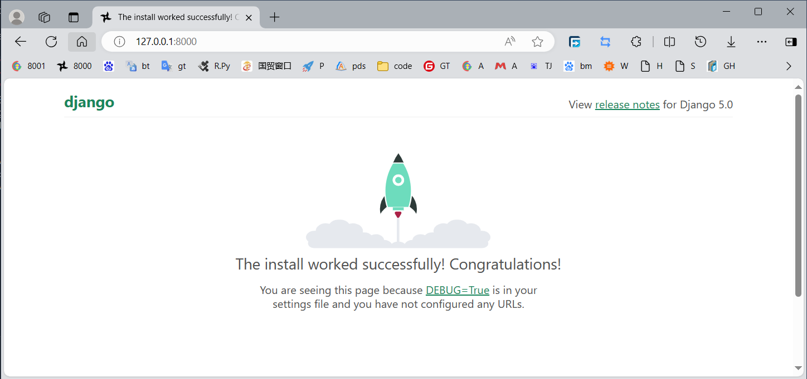
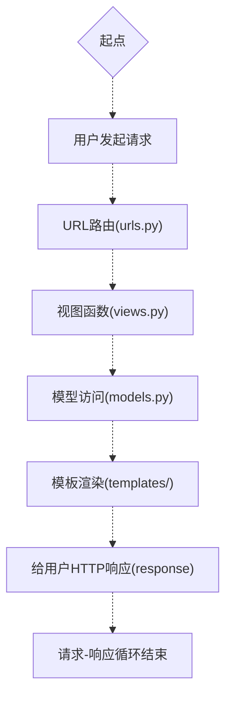

## 第一个项目
先创建一个项目练手。

进入虚拟环境，在你的文件夹下创建一个名为code的文件夹，以后所有项目文件都在些文件夹下创建。
```bash
alex@WSL2PC:~$ #(1)!
alex@WSL2PC:~$ source /home/alex/.venv/django/bin/activate #(2)!
(django) alex@WSL2PC:~$ #(3)!
(django) alex@WSL2PC:~$ mkdir code && cd code #(4)!
(django) alex@WSL2PC:~/code$ mkdir firstproject && cd firstproject #(5)!
(django) alex@WSL2PC:~/code/firstproject$ django-admin startproject firstproject #(6)!
(django) alex@WSL2PC:~/code/firstproject$ python manage.py runserver #(7)!
```

1. 位于用户文件夹下
2. 进入虚拟环境命令
3. 前面括号内表示已经进入虚拟环境django
4. 创建并进入code文件夹
5. 创建并进入firstproject文件夹
6. 创建项目
7. 运行项目


以下是运行服务的输出：
<!-- termynal: {title: output of last command} -->

``` 
Watching for file changes with StatReloader
Performing system checks...

System check identified no issues (0 silenced).

You have 18 unapplied migration(s). Your project may not work properly until you 
apply the migrations for app(s): admin, auth, contenttypes, sessions.
Run 'python manage.py migrate' to apply them.
May 04, 2024 - 07:30:20
Django version 5.0.4, using settings 'firstproject.settings'
Starting development server at http://127.0.0.1:8000/
Quit the server with CONTROL-C.

```

现在使用浏览器打开http://127.0.0.1:8000/，如果一切没错的话，可以看到一个欢迎页面。


## 理解Django的项目结构 

### 项目文件结构的概览

``` { .yaml .anotate}
 firstproject  #(1)!
 ├── db.sqlite3
 ├── firstproject
 │   ├── __init__.py #(2)!
 │   ├── asgi.py
 │   ├── settings.py #(3)!
 │   ├── urls.py  #(4)!
 │   └── wsgi.py  #(5)!
 ├── manage.py   #(6)!
 ├── app1/        #(7)!
 ├── app2/ 
 ├── ...
 
```

1. 最外层文件夹，包含所有项目相关的文件和文件夹
2. 这个空文件向python解释器表明这个文件夹是一个python包
3. Django项目的核心文件，包含所有项目设置（数据库、插入的app、中间件、认证以及其他设置）
4. 项目的URL模式，定义外部请求如何映射到相关视图的路径规则
5. 本文件用于部署Django项目。是WSGI的入口点
6. 用于启动Django项目的各种快捷命令行文件
7. 其它app文件夹，Django提倡模块化开发。项目中的每个逻辑单元都应被定义为一个app

### 流程图
在Django应用里，一个描述基础的请求-响应循环的简化版流程图如下：



一些原理性的介绍后继补上。

## 第一个APP

### 创建一个APP

``` bash
(django) alex@WSL2PC:~/code/firstproject$ python manage.py startapp news #(1)!
(django) alex@WSL2PC:~/code/firstproject$ ls #(2)!
db.sqlite3  firstproject  manage.py news
(django) alex@WSL2PC:~/code/firstproject$ ls news #(3)!
admin.py  apps.py  __init__.py  migrations  models.py  tests.py  views.py
```

1. 创建一个名为news的app
2. 列出项目文件夹中的所有文件和文件夹
3. 列出news文件夹中的所有文件和文件夹

### 配置已安装的apps
对于已经生成的app,如果需要启动，在settings.py中配置已安装的apps。

``` python
INSTALLED_APPS = [
    'django.contrib.admin',
    'django.contrib.auth',
    'django.contrib.contenttypes',
    'django.contrib.sessions',
    'django.contrib.messages',
    'django.contrib.staticfiles',
    'news', #(1)!
]
```

1. 添加news到已安装的apps中

## 视图
#### 创建第一个视图
按以下步骤创建我们的第一个视图：

打开 `news/views.py` 文件。输入以下代码：

``` python
from django.http import HttpResponse

def hello_world(request):
    return HttpResponse("Hello, world!")
```

#### 配置URL模式
打开 `firstproject/urls.py` 文件，输入以下代码：

``` python
from django.http import HttpResponse

def newsView(request):
    return HttpResponse("Hello, world. You're at the news index.")
```