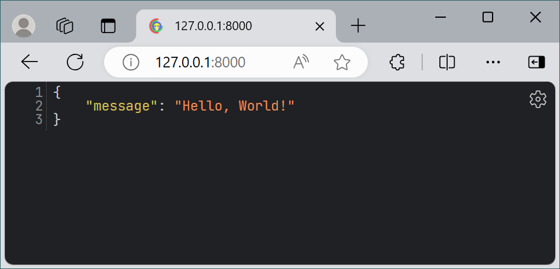

## FastAPI初试
FastAPI很短平快，以下首个试跑程序。

``` {.python .annotate hl_lines="4"} 
# c2_1st_app.py
{!./assets/py/fastapi_demo/c2_1st_app.py!}
``` 

1. 导入FastAPI类
2. 创建FastAPI实例
3. 定义路由和处理函数

vscode运行截图


浏览器访问截图


## 处理请求参数

### 路径参数

在一个网址中，`https://www.example.com/items/6`, **`6`**就是路径参数。在函数中用花括号括起来，FastAPI会自动解析。

```{.python .annotate hl_lines="5"} 
from fastapi import FastAPI

app = FastAPI()

@app.get("/items/{id}") #(1)!
async def read_item(id: int): #(2)!
    return {"item_id": item_id}
```

1. 路径参数用花括号括起来
2. 在函数声明中，可以直接使用花括号定义的变量


### 查询参数
在一个网址中，`https://www.example.com/items?page=4&size=2`, **`?page=4&size=2`**就是查询参数。在函数中声明中只要不匹配到路径参数，FastAPI会自动解析为查询参数。
```{.python .annotate hl_lines="6"} 
from fastapi import FastAPI

app = FastAPI()

@app.get("/items") 
async def read_item(page: int = 4, size: int = 2): #(1)!
    return {"page": page, "size": size}
```

1. 在函数声明中声明的参数，只要匹配不到路径参数，FastAPI会自动解析为查询参数


### 请求体
请求体一般包含用于数据库操作的JSON数据。它和查询参数一样，在函数声明中声明。
但是必须使用`Body`类型声明，表示它是请求体，否则FastAPI会把它当作查询参数去解析。
```{.python .annotate hl_lines="6"} 
from fastapi import FastAPI, Body

app = FastAPI()

@app.post("/items/")
async def create_item(name: str = Body(...), price: float = Body(...)): #(1)!
    return {"name": name, "price": price}
```

1. 在函数声明中，使用`Body`类型声明默认值，表示它是请求体

#### 插播：如何运行并测试写好API
FastAPI有自动生成的测试接口，可以用来测试API。


1. 打开WSL Debian,并进入项目文件夹。项目文件夹就是py文件所在的文件夹。输入 `code .`在当前位置打开vscode。
   
2. 在vscode命令行输入 `uvicorn c2_query:app'，并回车。
   
3. 程序运行无误，会弹出一个小窗口，点击小窗口`Open in Browser`，在浏览器中打开网址。
4. 在打开的网址后加上`/docs`，会打开API文档。
   
5. 可以在网页上测试刚写好的API了。
   

   
### 请求体和查询参数
请求体和查询参数可以同时使用。
```{.python .annotate hl_lines="8"} 
from fastapi import FastAPI, Body

app = FastAPI()

@app.post("/items/")


```

### 表单数据与文件上传

### 请求头和cookies

### 请求体

## 定制请求

### 路径操作参数

### 响应参数

### 发起HTTP错误

### 构建定制响应

## 多路由大项目的程序结构

## 总结 