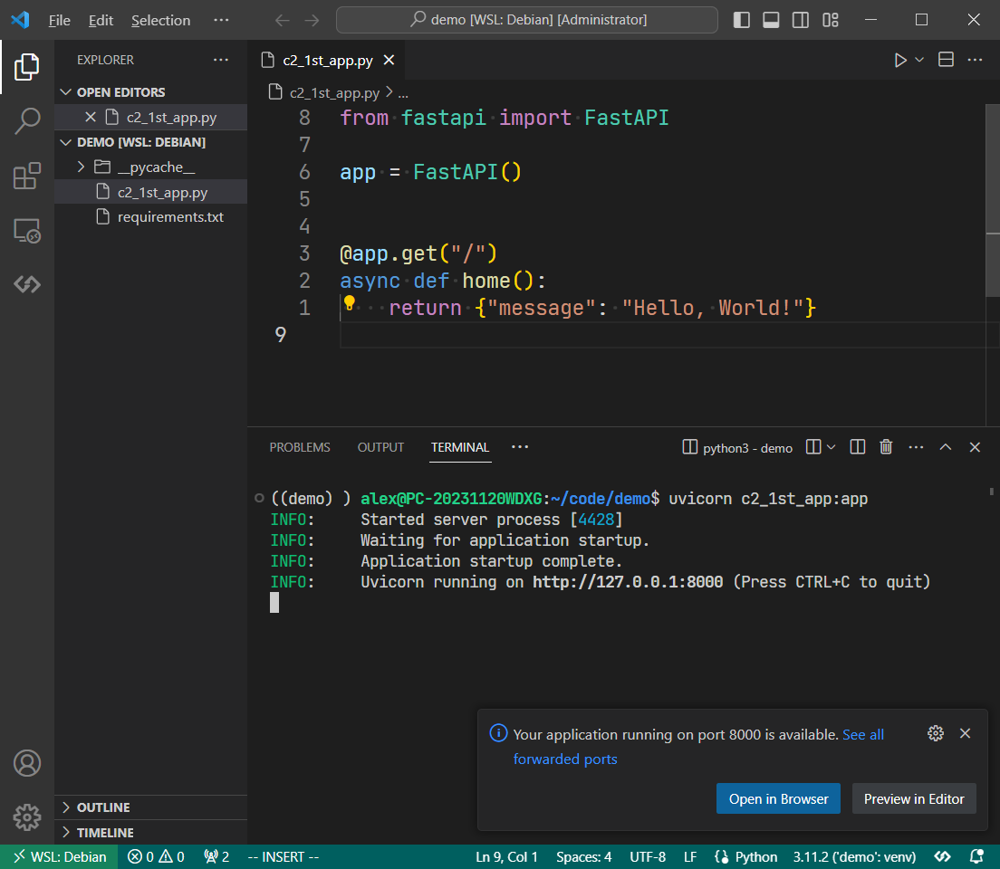
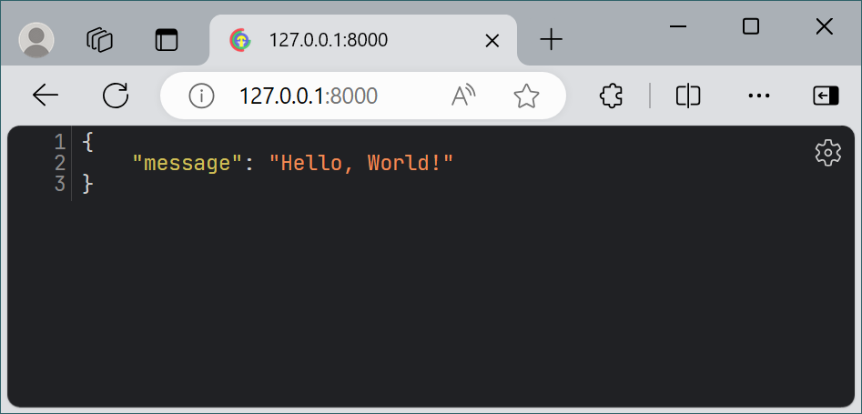

## FastAPI初试
FastAPI很短平快，以下首个试跑程序。

```py hl_lines="3"
{!./assets/py/fastapi_demo/c2_1st_app.py!}
```

vscode运行截图


浏览器访问截图


## 处理请求参数

### 路径参数

### 查询参数

### 请求体

### 表单数据与文件上传

### 请求头和cookies

### 请求体

## 定制请求

### 路径操作参数

### 响应参数

### 发起HTTP错误

### 构建定制响应

## 多路由大项目的程序结构

## 总结 