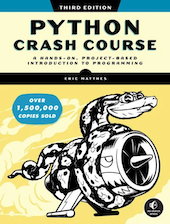
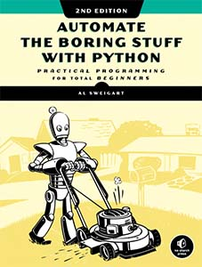
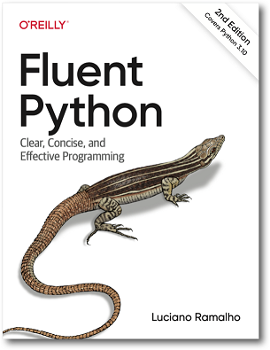
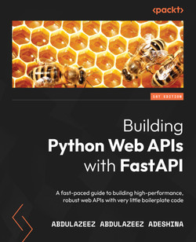

# 推荐Python书籍

## 入门

### [**Python Crash Course**](https://ehmatthes.github.io/pcc_3e/)

Python Crash Course is the world’s best-selling guide to the Python programming language. This fast-paced, thorough introduction will have you writing programs, solving problems, and developing functioning applications in no time.

You’ll start by learning basic programming concepts, such as variables, lists, classes, and loops, and practice writing clean code with exercises for each topic. You’ll also learn how to make your programs interactive and test your code safely before adding it to a project. You’ll put your new knowledge into practice by creating a Space Invaders–inspired arcade game, building a set of data visualizations with Python’s handy libraries, and deploying a simple application online.

As you work through the book, you’ll learn how to:

Use powerful Python libraries and tools, including pytest, Pygame, Matplotlib, Plotly, and Django
Make increasingly complex 2D games that respond to keypresses and mouse clicks
Generate interactive data visualizations using a variety of datasets
Build apps that allow users to create accounts and manage their own data, and deploy your apps online
Troubleshoot coding errors and solve common programming problems
New to this edition: This third edition is completely revised to reflect the latest in Python code. New and updated coverage includes VS Code for text editing, the pathlib module for file handling, pytest for testing your code, as well as the latest features of Matplotlib, Plotly, and Django.

If you’ve been thinking about digging into programming, Python Crash Course will provide you with the skills to write real programs fast. Why wait any longer? Start your engines and code!

!!! info "**Author Bio** "

    Eric Matthes was a high school science, math, and programming teacher, now full-time author, living in Alaska. He has been writing programs since he was five years old and is the author of the Python Flash Cards, also from No Starch Press.

---

### [**Automate the boring stuff with python**](https://automatetheboringstuff.com/)

**Practical Programming for Total Beginners**

If you've ever spent hours renaming files or updating hundreds of spreadsheet cells, you know how tedious tasks like these can be. But what if you could have your computer do them for you?

In Automate the Boring Stuff with Python, you'll learn how to use Python to write programs that do in minutes what would take you hours to do by hand - no prior programming experience required. Once you've mastered the basics of programming, you'll create Python programs that effortlessly perform useful and impressive feats of automation to:

* Search for text in a file or across multiple files
* Create, update, move, and rename files and folders
* Search the Web and download online content
* Update and format data in Excel spreadsheets of any size
* Split, merge, watermark, and encrypt PDFs
* Send reminder emails and text notifications
* Fill out online forms

Step-by-step instructions walk you through each program, and practice projects at the end of each chapter challenge you to improve those programs and use your newfound skills to automate similar tasks.

Don't spend your time doing work a well-trained monkey could do. Even if you've never written a line of code, you can make your computer do the grunt work. Learn how in Automate the Boring Stuff with Python.

!!! info "**About the Author**"

    Al Sweigart is a software developer and teaches programming to kids and adults. He has written several books for beginners and makes them freely available at InventWithPython.com. His personal website is AlSweigart.com.

## 进阶

### [**Fluent Python**](https://www.fluentpython.com/)

Don't waste time bending Python to fit patterns you've learned in other languages. Python's simplicity lets you become productive quickly, but often this means you aren't using everything the language has to offer. With the updated edition of this hands-on guide, you'll learn how to write effective, modern Python 3 code by leveraging its best ideas.

Discover and apply idiomatic Python 3 features beyond your past experience. Author Luciano Ramalho guides you through Python's core language features and libraries and teaches you how to make your code shorter, faster, and more readable.

Complete with major updates throughout, this new edition features five parts that work as five short books within the book:

* **Data structures**: Sequences, dicts, sets, Unicode, and data classes
* **Functions as objects**: First-class functions, related design patterns, and type hints in function declarations
* **Object-oriented idioms**: Composition, inheritance, mixins, interfaces, operator overloading, protocols, and more static types
* **Control flow**: Context managers, generators, coroutines, async/await, and thread/process pools
* **Metaprogramming**: Properties, attribute descriptors, class decorators, and new class metaprogramming hooks that replace or simplify metaclasses

## 应用 

### [**Building Python Web APIs with FastAPI**](https://www.oreilly.com/library/view/building-python-web/9781801076630/)

Discover FastAPI features and best practices for building and deploying high-quality web APIs from scratch

**Key Features**

* A practical guide to developing production-ready web APIs rapidly in Python
* Learn how to put FastAPI into practice by implementing it in real-world scenarios
* Explore FastAPI, its syntax, and configurations for deploying applications

**Book Description**

RESTful web services are commonly used to create APIs for web-based applications owing to their light weight and high scalability. This book will show you how FastAPI, a high-performance web framework for building RESTful APIs in Python, allows you to build robust web APIs that are simple and intuitive and makes it easy to build quickly with very little boilerplate code.

This book will help you set up a FastAPI application in no time and show you how to use FastAPI to build a REST API that receives and responds to user requests. You'll go on to learn how to handle routing and authentication while working with databases in a FastAPI application. The book walks you through the four key areas: building and using routes for create, read, update, and delete (CRUD) operations; connecting the application to SQL and NoSQL databases; securing the application built; and deploying your application locally or to a cloud environment.

By the end of this book, you'll have developed a solid understanding of the FastAPI framework and be able to build and deploy robust REST APIs.

**What you will learn**

* Set up a FastAPI application that is fully functional and secure
* Understand how to handle errors from requests and send proper responses in FastAPI
* Integrate and connect your application to a SQL and NoSQL (MongoDB) database
* Perform CRUD operations using SQL and FastAPI
* Manage concurrency in FastAPI applications
* Implement authentication in a FastAPI application
* Deploy a FastAPI application to any platform

**Who this book is for**

This book is for Python developers who want to learn FastAPI in a pragmatic way to create robust web APIs with ease. If you are a Django or Flask developer looking to try something new that's faster, more efficient, and produces fewer bugs, this FastAPI Python book is for you. The book assumes intermediate-level knowledge of Python programming.

