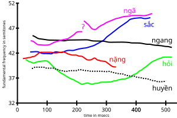

!!! warning ""
    
    :material-update:{.red} 持续更新中......

## :simple-airbrake: 元音 12个
元音教材上说是11个（i和y他们算一个），实际上是以下12个。

按照拼音a(啊) o(欧) e(呃) i(衣) u(屋)，把元音分成6组记忆。

!!! tip "读音"

    鼠标悬浮在脚注上，点:fontawesome-solid-play:{.red}播放按钮就可以听到。

    <audio controls> <source src="../assets/audio/nhau.mp3" type="audio/mpeg"> NOP </audio>

| 汉语拼音             | 基准音      | 变化音      | 备注                    |
|----------------------|-------------|-------------|-------------------------|
| a                    | **a** [^1]  | **ă** [^2]  |                         |
| o                    | **o** [^3]  | **ô** [^4]  | 可以理解为ao ou?        |
| e                    | **ơ** [^5]  | **â** [^6]  |                         |
| i                    | **i** [^7]  | **y** [^8]  |                         |
| u                    | **u** [^9]  | **ư** [^10] | ư发音时咬牙状，发“呃”音 |
| :simple-xing: {.red} | **e** [^11] | **ê** [^12] | e类似英语的 ˈɛ   (IPA)  |

>所有的变化音，都是基准音的变音。可以理解为半音，即减弱缩短的基准音。

## :simple-codio: 辅音 27
所有的辅音读音，后面都加了ở，以便发音。

| 1st            | 2nd         | 3rd        |
|----------------|-------------|------------|
| p     [^13]    | m     [^14] | ph   [^15] |
| v     [^16]    | t     [^17] | th   [^18] |
| c/k/q [^19]    | kh    [^20] | h    [^21] |
| n     [^22]    | l     [^23] |            |
| tr    [^24]    | ch    [^25] |            |
| s     [^26]    | x     [^27] | r    [^28] |
| d {.red} [^29] | gi    [^30] |            |
| b     [^31]    | đ     [^32] |            |
| nh    [^33]    | ng/ngh[^34] | g/gh [^35] |

## :simple-vectorlogozone: 声调
| 示例      | 越南名 | 中文名 |
|-----------|--------|--------|
| mạ  [^36] | ngang  | 平声   |
| má  [^37] | sắc    | 锐声   |
| mà  [^38] | huyền  | 玄声   |
| mả  [^39] | hỏi    | 问声   |
| mã  [^40] | ngã    | 跌声   |
| mạ  [^41] | nặng   | 重声   |

声调很需要感觉去理解，不能靠记忆。以下是帮助理解的声调长度与强度示意

{ width=520}

## :simple-materialdesignicons: 一些杂记
- ưa [读音ươ] ua [读音uô] ia[读音iơ] 读音注意，不读a[^1]  不读 /a/ 原声，而弱化为 /ə/[^5]。 如下例句
  > sữa [^42] 牛奶:material-cow:{.red}   ---> mua [^43] 购买:material-cash-100:{.green}   ---> bia [^44] 啤酒:material-beer:{.orange} 

- m,p,ong,ông,ung,oc,ôc,uc 结尾的需要闭55

    | :simple-sketchup:{.red} 闭嘴                 | :simple-sketchup:{.red} 闭嘴      | :simple-sketchup:{.red} 闭嘴           |
    |----------------------------------------------|-----------------------------------|----------------------------------------|
    | :fontawesome-solid-bowl-rice: Cơm[^45]       | :material-corn: Bắp[^46]          | :fontawesome-brands-forumbee: Ong[^47] |
    | :fontawesome-brands-cotton-bureau: Bông[^48] | :fontawesome-solid-gun: Súng[^49] | :fontawesome-solid-frog: Cóc[^50]      |
    | :material-pine-tree: Mộc[^51]                | :material-flower: Cúc[^52]        |                                        |

- 以 -p, -t, -ch, -c 结尾的是入声韵尾，越南语中只能配 sắc 或 nặng

    | :simple-portableappsdotcom:{.red} Sắc    | :simple-target:{.red} Nặng  |
    |------------------------------------------|-----------------------------|
    | :fontawesome-solid-kitchen-set: Bếp[^53] | :material-pretzel: Đẹp[^54] |
    | :simple-coolermaster: Mát[^55]           | :simple-facebook: Mặt[^56]  |
    | :simple-gitbook: Mách[^57]               | :simple-ccleaner: Sách[^58] |
    | :material-water-outline: Nước[^59]       | :simple-w3schools: Học[^60] |

## :simple-primefaces:发音参考

[^1]: > a <audio controls> <source src="../assets/audio/a.mp3" type="audio/mpeg"> NOP </audio>
[^2]: > ă <audio controls> <source src="../assets/audio/ă.mp3" type="audio/mpeg"> NOP </audio> 
[^3]: > o <audio controls> <source src="../assets/audio/o.mp3" type="audio/mpeg"> NOP </audio>
[^4]: > ô <audio controls> <source src="../assets/audio/ô.mp3" type="audio/mpeg"> NOP </audio>
[^5]: > ơ <audio controls> <source src="../assets/audio/ơ.mp3" type="audio/mpeg"> NOP </audio>
[^6]: > â <audio controls> <source src="../assets/audio/â.mp3" type="audio/mpeg"> NOP </audio>
[^7]: > i <audio controls> <source src="../assets/audio/i.mp3" type="audio/mpeg"> NOP </audio>
[^8]: > y <audio controls> <source src="../assets/audio/y.mp3" type="audio/mpeg"> NOP </audio>
[^9]: > u <audio controls> <source src="../assets/audio/u.mp3" type="audio/mpeg"> NOP </audio>
[^10]: > ư <audio controls> <source src="../assets/audio/ư.mp3" type="audio/mpeg"> NOP </audio>
[^11]: > e <audio controls> <source src="../assets/audio/e.mp3" type="audio/mpeg"> NOP </audio>
[^12]: > ê <audio controls> <source src="../assets/audio/ê.mp3" type="audio/mpeg"> NOP </audio>
[^13]: 
    > P：拼音b，不送气 :simple-gitbook:
    <audio controls> <source src="../assets/audio/p.mp3" type="audio/mpeg"> NOP </audio>
[^14]: > m <audio controls> <source src="../assets/audio/m.mp3" type="audio/mpeg"> NOP </audio>
[^15]: > ph <audio controls> <source src="../assets/audio/ph.mp3" type="audio/mpeg"> NOP </audio>
[^16]: > v <audio controls> <source src="../assets/audio/v.mp3" type="audio/mpeg"> NOP </audio>
[^17]: > t <audio controls> <source src="../assets/audio/t.mp3" type="audio/mpeg"> NOP </audio>
[^18]: > th <audio controls> <source src="../assets/audio/th.mp3" type="audio/mpeg"> NOP </audio>
[^19]: > c/k/q <audio controls> <source src="../assets/audio/c-k-q.mp3" type="audio/mpeg"> NOP </audio>
[^20]: > kh <audio controls> <source src="../assets/audio/kh.mp3" type="audio/mpeg"> NOP </audio>
[^21]: > h <audio controls> <source src="../assets/audio/h.mp3" type="audio/mpeg"> NOP </audio>
[^22]: > n <audio controls> <source src="../assets/audio/n.mp3" type="audio/mpeg"> NOP </audio>
[^23]: > l <audio controls> <source src="../assets/audio/l.mp3" type="audio/mpeg"> NOP </audio>
[^24]: > tr <audio controls> <source src="../assets/audio/tr.mp3" type="audio/mpeg"> NOP </audio>
[^25]: > ch <audio controls> <source src="../assets/audio/ch.mp3" type="audio/mpeg"> NOP </audio>
[^26]: > s <audio controls> <source src="../assets/audio/s.mp3" type="audio/mpeg"> NOP </audio>
[^27]: > x <audio controls> <source src="../assets/audio/x.mp3" type="audio/mpeg"> NOP </audio>
[^28]: > r <audio controls> <source src="../assets/audio/r.mp3" type="audio/mpeg"> NOP </audio>
[^29]: > d <audio controls> <source src="../assets/audio/d.mp3" type="audio/mpeg"> NOP </audio>
[^30]: > gi <audio controls> <source src="../assets/audio/gi.mp3" type="audio/mpeg"> NOP </audio>
[^31]: > b <audio controls> <source src="../assets/audio/b.mp3" type="audio/mpeg"> NOP </audio>
[^32]: > đ <audio controls> <source src="../assets/audio/đ.mp3" type="audio/mpeg"> NOP </audio>
[^33]: > nh <audio controls> <source src="../assets/audio/nh.mp3" type="audio/mpeg"> NOP </audio>
[^34]: > ng/ngh <audio controls> <source src="../assets/audio/ng.mp3" type="audio/mpeg"> NOP </audio>
[^35]: > g/gh <audio controls> <source src="../assets/audio/g.mp3" type="audio/mpeg"> NOP </audio>
[^36]: > ma <audio controls> <source src="../assets/audio/ma.mp3" type="audio/mpeg"> NOP </audio>
[^37]: > má <audio controls> <source src="../assets/audio/má.mp3" type="audio/mpeg"> NOP </audio>
[^38]: > mà <audio controls> <source src="../assets/audio/mà.mp3" type="audio/mpeg"> NOP </audio>
[^39]: > mả <audio controls> <source src="../assets/audio/mả.mp3" type="audio/mpeg"> NOP </audio>
[^40]: > mã <audio controls> <source src="../assets/audio/mã.mp3" type="audio/mpeg"> NOP </audio>
[^41]: > mạ <audio controls> <source src="../assets/audio/mạ.mp3" type="audio/mpeg"> NOP </audio>
[^42]: > sữa <audio controls> <source src="../assets/audio/sữa.mp3" type="audio/mpeg"> NOP </audio>
[^43]: > mua <audio controls> <source src="../assets/audio/mua.mp3" type="audio/mpeg"> NOP </audio>
[^44]: > bia <audio controls> <source src="../assets/audio/bia.mp3" type="audio/mpeg"> NOP </audio>
[^45]: > cơm <audio controls> <source src="../assets/audio/cơm.mp3" type="audio/mpeg"> NOP </audio>
[^46]: > bắp <audio controls> <source src="../assets/audio/bắp.mp3" type="audio/mpeg"> NOP </audio>
[^47]: > ong <audio controls> <source src="../assets/audio/ong.mp3" type="audio/mpeg"> NOP </audio>
[^48]: > bông <audio controls> <source src="../assets/audio/bông.mp3" type="audio/mpeg"> NOP </audio>
[^49]: > súng <audio controls> <source src="../assets/audio/súng.mp3" type="audio/mpeg"> NOP </audio>
[^50]: > cóc <audio controls> <source src="../assets/audio/cóc.mp3" type="audio/mpeg"> NOP </audio>
[^51]: > mộc <audio controls> <source src="../assets/audio/mộc.mp3" type="audio/mpeg"> NOP </audio>
[^52]: > cúc <audio controls> <source src="../assets/audio/cúc.mp3" type="audio/mpeg"> NOP </audio>
[^53]: bếp <audio controls> <source src="../assets/audio/bếp.mp3" type="audio/mpeg"> NOP </audio>
[^54]: > đẹp <audio controls> <source src="../assets/audio/đẹp.mp3" type="audio/mpeg"> NOP </audio>
[^55]: > mát <audio controls> <source src="../assets/audio/mát.mp3" type="audio/mpeg"> NOP </audio>
[^56]: > mặt <audio controls> <source src="../assets/audio/mặt.mp3" type="audio/mpeg"> NOP </audio>
[^57]: > sách <audio controls> <source src="../assets/audio/sách.mp3" type="audio/mpeg"> NOP </audio>
[^58]: > sạch <audio controls> <source src="../assets/audio/sạch.mp3" type="audio/mpeg"> NOP </audio>
[^59]: > nước <audio controls> <source src="../assets/audio/nước.mp3" type="audio/mpeg"> NOP </audio>
[^60]: > học <audio controls> <source src="../assets/audio/học.mp3" type="audio/mpeg"> NOP </audio>

