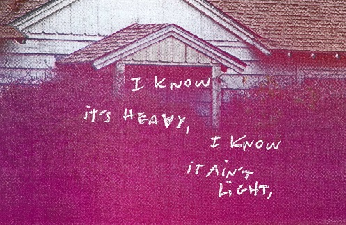
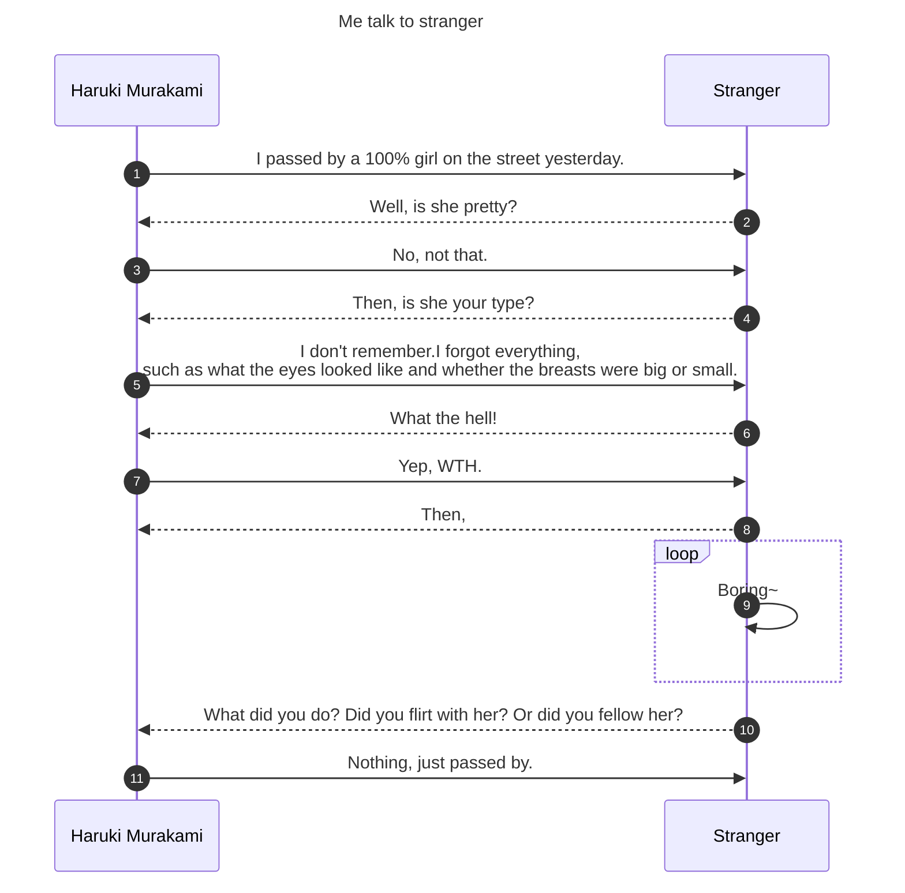

# 遇到百分百的女孩

[__村上春树__](# "Author") [^3] (1)
{.annotate}

1. :japanese_ogre:{.red} Haruki Murakami (born January 12, 1949, [Kyōto](https://www.britannica.com/place/Kyoto-Japan), Japan) is a Japanese novelist, short-story writer, and translator whose deeply imaginative and often [ambiguous](https://www.merriam-webster.com/dictionary/ambiguous) books became international bestsellers.

???+ example "__Month of may__ [^2]"
    :fontawesome-solid-1:{.red} :fontawesome-solid-2:{.orange} :material-numeric-3-box:{.yellow} :fontawesome-solid-4:{.green}<br>
    <!--  -->

!!! danger inline end "Not suprise"
    *This was sounds from ur right airpods pro, the left one is broken* (1)
    {.annotate}

    1. To fix 1 broken airpods pro, needed :simple-monkeytie:{.red} ￥140 (1),which I can not afforded.
    {.annotate}

        1. Yes, Chinese Yuan

[:material-music:{.red} In case you're curious(tm)](https://www.bilibili.com/video/BV1ot4y1a7VR/?share_source=copy_web&vd_source=c20252858426a772b29274bb15c52367){ .md-button } <br>

[:material-home: Go home if you're tired (r)](https://al666ex.pages.dev){ .md-button .md-button--primary } <br><br>

四月一个晴朗的早晨，我在原宿后街同一个百分之百的女孩擦肩而过。

不讳地说，女孩算不得怎么漂亮，并无吸引人之处，衣着也不出众，脑后的头发执着地带有睡觉挤压的痕迹。年龄也已不小了- -应该快有30了。严格地说来，恐怕很难称之为女孩。然而，相距50米开外我便一眼看出：对于我来说，她是个百分之百的女孩。从看见她身姿的那一瞬间，我的胸口便如发生地鸣一般的震颤，口中如沙漠干得沙沙作响。

=== "1st Four"

    Gonna make a record in the __month of May__{.blue}

    In the month of May, in the __month of May__

    Gonna make a record in the __month of May__

    *When the violent wind blows the wires away*

=== "Show^In^Markdown"

    ```markdown    
    Gonna make a record in the __month of May__{.blue}

    In the month of May, in the __month of May__

    Gonna make a record in the __month of May__

    *When the violent wind blows the wires away*
    ```

或许你也有你的理想女孩。例如喜欢足颈细弱的女孩，毕竟眼睛大的女孩，十指绝对好看的女孩，或不明所以地迷上慢慢花时间进食的女孩。我当然有自己的偏爱。在饭店时就曾看邻桌一个女孩的鼻形看得发呆。

| Atrribute            |                  Rank                  |
| -------------------- | :------------------------------------: |
| Weak foot and neck   |            :material-check:            |
| Big eyes             |          :material-check-all:          |
| Good-looking fingers |    :fontawesome-regular-thumbs-up:     |
| Eating slowly        |         :material-close:{.red}         |
| Shape of nose        | :fontawesome-solid-ranking-star:{.red} |

但要明确勾勒百分之百的女孩形象，任何人都无法做到。我就绝对想不起她长有怎样的鼻子。甚至是否有鼻子都已记不真切，现在我所能记的，只有她并非十分漂亮这一点。事情也真是不可思议。

“昨天在路上同一个百分之百的女孩擦肩而过。”我对一个人说。

“唔，”他应道，“人可漂亮？”

“不，不是说这个。”

“那，是合你口味那种类型喽？”

“记不得了。眼睛什么样啦，胸部是大是小啦，统统忘得一干二净。”

“莫名其妙啊！”

“是莫名其妙。”

“那么，”他显得兴味索然，“你做什么了？搭话了？还是跟踪了？”

“什么都没有做。”我说，“仅仅是擦肩而过。”



她由东往西走，我从西向东去，在四月里一个神清气爽的早晨。[^1]

!!! example ""

    :fontawesome-brands-pied-piper-alt:{.red} ~~Month of May~~{.red}, it's a ^^violent^^{.green} thing

    In the city their hearts start to sing

    ==Well, some people sing,==

    It sounds like they're __==screaming==__

    Used to doubt it

    ^^But now I believe it^^

我想和她说话，哪怕30分钟也好。想打听她的身世，也想全盘托出自己的身世。而更重要的，是想弄清导致 __1981__{.red} 年 __4__{.red} 月一个晴朗的早晨我们在原宿后街擦肩而过这一命运的原委。里面肯定充满和平时代的古老机器:material-checkbox-multiple-blank-circle-outline:般温馨的秘密。

如此谈罢，我们可以找地方吃午饭，看伍迪·爱伦的影片，再顺路到宾馆里的酒吧喝鸡尾酒什么的。弄得好，喝完说不定能同她睡上一觉。

可能性在扣击我的心扉。

我和她之间的距离以近至十五六米了。

问题是，我到底该如何向她搭话呢？

<div class="grid cards" markdown>

- :material-clock-fast:{ .lg .middle .blue} __SILLY__

    ---

    Hello! Can you talk to me? Even for 30 minutes.

- :material-wall-sconce-round-variant:{ .lg .middle .blue} __SILLY2__

    ---

    Excuse me, is there any laundromat open 24 hours in this area?

</div>

<div class="grid cards" markdown>

- :fontawesome-solid-explosion:{ .lg .middle .red} __STRAIGHT__
  
    ---

    __Hello! You are the perfect girl for me!__{.red}

</div>
“你好！和我说说话可以吗？哪怕30分钟也好。”

过于傻气，简直象劝人加入保险。

“请问，这一带有24小时营业的洗衣店吗？”

这也同样傻里傻气。何况我岂非连洗衣袋都没带！有谁能相信我的道白呢？

也许开门见山好些。“你好！你对我可是百分之百的女孩哟！”

不，不成，她恐怕不会相信我的表白。纵然相信，也未必愿同我说什么话。她可能这样说：即便我对你是百分之百的女孩，你对我可不是百分之百的男人，抱歉！而这是大有可能的。假如陷入这般境地，我肯定全然不知所措。这一打击说不定使我一蹶不振。我已32岁，所谓上年纪归根结底便是这么一回事。

我是在花店门前和她擦肩而过的，那暖暖的小小的气块儿触到我的肌肤。柏油路面洒了水，周围荡漾着玫瑰花香。连向她打声招呼我都未能做到。她身穿白毛衣，右手拿一个尚未贴邮票的四方信封。她给谁写了封信。那般睡眼惺忪，说不定整整写了一个晚上。那四方信封里有可能装有她的全部秘密。

{ align=left width=350}
走几步回头时，她的身影早已消失在人群中。

<hr/><br>

当然，今天我已完全清楚当时应怎样向她搭话。但不管怎么说，那道白实在太长，我笃定表达不好――就是这样，我所想到的每每不够实用。

总之，道白自“很久很久以前”开始，而以“你不觉得这是个忧伤的故事吗”结束。

!!! example ""
    - [x] Month of May, everybody's in love
    - [x] Then the city was hit from above
    - [x] And just when I knew what I wanted to say
    - [x] A violent wind blew the wires away
    - [ ] :octicons-star-16: :octicons-star-16: :octicons-star-16: :octicons-star-16:
    - [x] We were shocked in the suburbs

很久很久以前，有个地方有一个少男和一个少女。少男18，少女16。少男算不得英俊，少女也不怎么漂亮，无非随处可见的孤独而平常的少男少女。但两人一直坚信世上某个地方一定存在百分之百适合自己的少女和少男。是的，两人相信奇迹，而奇迹果真发生了。

一天两人在街头不期而遇。

“真巧！我一直在寻找你。也许你不相信，你对我是百分之百的男孩。从头到脚跟我想象的一模一样。简直是在做梦。”

两人坐在公园长椅上，手拉手，百谈不厌。两人已不再孤独。百分之百需求对方，百分之百已被对方需求。而百分之百需求对方和百分之百地被对方需求是何等美妙的事情啊！这已是宇宙奇迹！

!!! example ""

    Now the kids are all standing with their arms folded tight

    ^^Kids are all standing with their arms folded tight^^

    Well, some things are pure and some things are right

    ==But the kids are still standing with their arms folded tight==

    I said some things are pure and some things are right

    But the kids are still standing with their arms folded tight

    !!! failure inline "Equation of love"
        $$
        \begin{aligned}
        e^{i\pi}+1&=0   \\
        1&= -e^{i\pi}  \\
        100 \% &= -e^{i\pi} 
        \end{aligned}
        $$

但两人心中掠过一个小小的，的确小而又小的疑虑：梦想如此轻易成真是否就是好事？

交谈突然中断时，少男这样说道：

“我说，再尝试一次吧！如果我们两人真是一对百分之百的恋人的话，肯定还会有一天在哪里相遇。下次相遇时如果仍觉得对方百分之百，就马上在那里结婚，好么？”

“好的。”少女回答。

于是两人分开，各奔东西。

!!! example ""

    :simple-youtubegaming: [So young](# "So young"), so young,

    :material-heart-broken:{.red title="808 & HEART BREAK"} So much pain for someone so young, well

    :material-vanity-light: I know it's heavy, I know it ain't light

    :fontawesome-solid-dharmachakra: But how you gonna lift it with your arms folded tight?

    :material-town-hall: First they built the road, then they built the town

    :material-car-estate:{.green title="Hey Porsche"} That's why we're still driving around

    :material-gamepad-circle-up: And around  :octicons-x-circle-fill-12:{.red} :fontawesome-solid-7:{.red}
    
然而说实在话，根本没有必要尝试，纯属多此一举。为什么呢？因为两人的的确确是一对百分之百的恋人，因为那是奇迹般的邂逅。但两人过于年轻，没办法知道这许多。于是无情的命运开始捉弄两人。

一年冬天，两人都染上了那年肆虐的恶性流感。在死亡线徘徊几个星期后，过去的记忆丧失殆尽。事情也真是离奇。当两人睁眼醒来时，脑袋里犹如D·H劳伦斯少年时代的贮币盒一样空空如也。

但这对青年男女毕竟聪颖豁达且极有毅力，经过不懈努力，终于再度获得了新的知识新的情感，胜任愉快地重返社会生活。啊，我的上帝！这两人真是无可挑剔！他们完全能够换乘地铁，能够在邮局寄交快信了。并且分别体验了百分之七十五和百分之八十五的恋爱。

如此一来二去，少男32，少女31岁了。时光以惊人的速度流逝。

四月一个晴朗的早晨，少男为喝折价早咖啡沿原宿后街由西向东走，少女为买快信邮票沿同一条街由东向西去，两人恰在路中间失之交臂。失却的记忆的微光刹那间照亮两颗心。两人胸口陡然悸颤，并且得知：

她对我是百分之百的女孩。

他对我是百分之百的男孩。

然而两人记忆的烛光委实过于微弱，两人的话语也不似十四年前那般清晰。结果连句话也没说便擦身而过，径直消失在人群中，永远永远。

<!-- termynal: {title: Music Loading...}-->

```console
$   Two-thousand nine, two-thousand ten
$   Wanna make a record how I felt then
$   When we stood outside in the month of May
$   And watched the violent wind blow the wires away

$   If I die in the month of May
$   Let the wind take my body away, yeah
$   I wish I may, I wish I might
$   Don't lay me down there with my arms folded tight
---> 100%
```

你不觉得这是个令人感伤的故事么？

是的，我本该这样向她搭话。

!!! example ""

    !!! failure ""
        Start again in the month of May

        Start again in the month of May

        Come on and blow the wires away

        Come on and blow the wires away   __x 2__{.red}

    Start again in the month of May

    Start again in the month of May

    Come on and blow the wires away

    Come on and blow __the wires x 2__{.red} away

[^1]: April was not a good Month.
[^2]: [Arcade Fire](https://store.arcadefire.com/products/we-standard-cd-poster-redemption)
[^3]: :japanese_ogre:{.red} Haruki Murakami (born January 12, 1949, [Kyōto](https://www.britannica.com/place/Kyoto-Japan), Japan) is a Japanese novelist, short-story writer, and translator whose deeply imaginative and often [ambiguous](https://www.merriam-webster.com/dictionary/ambiguous) books became international bestsellers.
